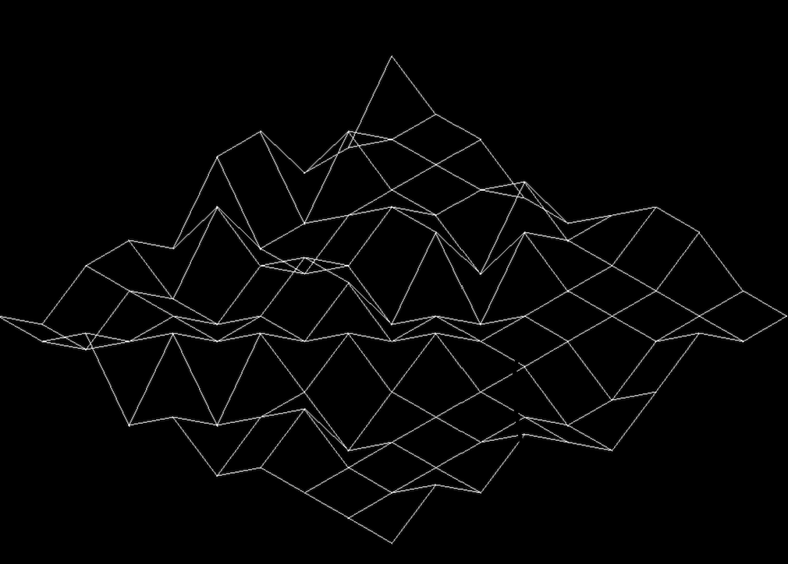

# Fdf
This project consists of creating program that generates a 3D representation of a landscape with relief, 
using the 42 miniLibX library.
if you want to dowload minilibX: https://github.com/42Paris/minilibx-linux

## Usage
    make
  This program receives the map file as an argument
```bash
./fdf test_maps/42.maps
```
Established map format:
- You have to pass a map with rectangular form.
- All rows must have the same number of numbers(points);  they cannot be greater than the MAX_INT.
- For pass colors to the map your number map has to have this format: [number][,][hexadecimal number]
- Each row must be separated by a "\n".
  Example map:
```bash
1 0 0 -1 -1 0 1 1 0 0 
-1 0 0 0 1 0 0 0 0 0 
-1 1 0 0 -1 1 0 0 0 1 
1 -1 0 1 1 -1 0 0 -1 0 
1 -1 -1 0 -1 0 0 0 -1 -1 
-1 1 0 1 1 0 1 0 0 0 
0 -1 -1 0 0 1 0 0 0 1 
0 0 0 0 1 0 -1 0 0 0 
-1 -1 0 1 -1 0 1 0 0 1 
0 0 1 -1 0 -1 0 0 0 0 
```
Output:

